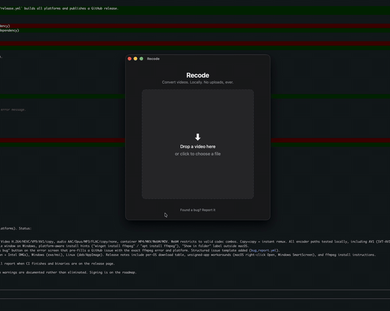

# Recode

Convert videos without touching a terminal. Local and private, nothing ever leaves your machine.

Drop a video, pick what you want, done. No codec jargon, no upload, no file size limits. Runs on macOS, Windows, and Linux.

## Demo



[Full-quality demo video](assets/demo.mp4)

## Download

Grab the latest build for your system from [Releases](https://github.com/AdityaPainuli/recode/releases/latest):

| System | File |
|---|---|
| macOS (Apple Silicon: M1/M2/M3/M4) | `Recode_*_aarch64.dmg` |
| macOS (Intel) | `Recode_*_x64.dmg` |
| Windows | `Recode_*_x64-setup.exe` (or `.msi`) |
| Linux (Debian/Ubuntu) | `Recode_*_amd64.deb` |
| Linux (any distro) | `Recode_*_amd64.AppImage` |

**macOS note**: builds are not code-signed yet. Right-click the app and choose *Open* the first time, or run `xattr -cr /Applications/Recode.app`.

**Windows note**: SmartScreen may warn because the installer is unsigned. *More info* → *Run anyway*.

**Requirement**: Recode uses your system's ffmpeg. Install once: `brew install ffmpeg` (macOS), `winget install ffmpeg` (Windows), `sudo apt install ffmpeg` (Debian/Ubuntu). The app shows this instruction on first launch if it's missing.

## Presets

| Preset | What it does | Output |
|---|---|---|
| Play anywhere | H.264/AAC, works on any device or app | `.mp4` |
| Smaller file | HEVC (hardware-accelerated on macOS) | `.mp4` |
| Web video | VP9/Opus for browsers | `.webm` |
| Audio only | Strips video, keeps sound | `.m4a` |
| Edit in DaVinci | DNxHR HQ + PCM audio. Fixes DaVinci Resolve free (especially Linux) refusing H.264/H.265/AAC footage | `.mov` |

## Advanced mode

For technical users: *Advanced: pick exact codecs* opens direct codec selection.

- Video: H.264, H.265/HEVC, VP9, AV1, DNxHR HQ, ProRes HQ, or copy (remux without re-encoding)
- Audio: AAC, Opus, MP3, FLAC, PCM, copy, or none
- Container: MP4, MKV, WebM, MOV

Copy + a different container = instant remux, no quality loss.

Output lands next to the original as `name (recoded).ext`. Originals are never touched.

## Reporting bugs

Use the **Found a bug? Report it** link in the app footer (the error screen has one too, pre-filled with the error output). It opens a GitHub issue here so it can be investigated. Or file one directly: [new issue](https://github.com/AdityaPainuli/recode/issues/new/choose).

## Stack

- [Tauri 2](https://tauri.app) (Rust backend, system webview)
- React + TypeScript + Vite frontend
- ffmpeg for the actual conversion (system install for now, bundled sidecar planned)

## Development

Requires Rust, Node, and ffmpeg.

```sh
npm install
npm run tauri dev
```

Build a distributable app:

```sh
npm run tauri build
```

Releases are built by CI: push a `v*` tag and `.github/workflows/release.yml` builds all platforms and publishes a GitHub release.

## Roadmap

- [ ] Bundle static ffmpeg as a Tauri sidecar (no system ffmpeg dependency)
- [ ] Batch conversion (drop multiple files)
- [ ] Custom output folder
- [ ] Code signing (macOS notarization, Windows)
